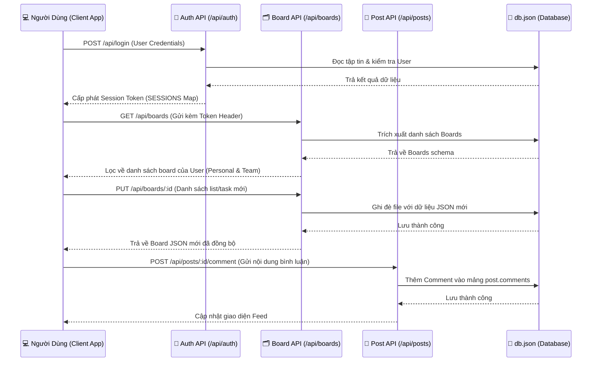

# SE104.Q28 Project Management System

Hệ thống quản lý công việc và bảng tin dành cho sinh viên SE104.Q28, với chức năng quản lý bảng Kanban (Cá nhân/Nhóm) và tính năng theo dõi bảng tin (News Feed).

## 📂 Cấu trúc thư mục (File Structure)

```text
/
├── server.ts               # Backend Entry Point: Server và tích hợp các Routes
├── db.json                 # Database hệ thống (tự động tạo ra)
├── vite.config.ts          # Cấu hình Vite build
├── package.json            # Thư viện và Script (dependencies)
├── tsconfig.json           # Cấu hình TypeScript
├── index.html              # Frontend Entry Point HTML
├── .env.example            # Chứa các mẫu hằng số môi trường (nếu có)
│
├── config/                 # Các thiết lập cấu hình chung
│   └── db.ts               # Quản lý Database JSON cục bộ và dữ liệu mock
│
├── api/                    # Phân rã REST API (Backend logic)
│   ├── index.ts            # Entry router chính gom các cụm API
│   ├── auth.ts             # API cho Đăng nhập, Đăng ký, Xét thực (Auth)
│   ├── boards.ts           # API cho tác vụ xử lý Bảng việc Kanban (Boards)
│   └── posts.ts            # API cho thao tác Bảng tin nội bộ (News Feed)
│
└── src/                    # Frontend React src
    ├── main.tsx            # React Bootstrap Entry
    ├── App.tsx             # Component gốc, khung Layout và Routing nội bộ
    ├── index.css           # Cấu hình file CSS / Tailwind
    ├── types.ts            # Khai báo TypeScript Interface cho hệ thống
    │
    └── components/         # Các Reusable components giao diện
        ├── LoginView.tsx       # Component Form Auth (Đăng ký, Đăng nhập)
        ├── NewsFeedView.tsx    # Giao diện Bảng tin/Status của hệ thống
        └── KanbanColumn.tsx    # Khối component cột và thẻ List/Tasks cho Kanban Boards
```

## 💾 Cấu trúc dữ liệu (Data Structure)

Dựa trên định nghĩa mã nguồn (`src/types.ts`) và quy định xử lý backend tại `server.ts`, hệ thống sử dụng cấu trúc tổ chức JSON file định quy bao gồm các Model chính sau:

### 1. Users Data (Tài khoản người dùng)
Đại diện cho thông tin tài khoản người dùng đăng nhập hệ thống:

```typescript
export interface User {
  username: string;       // UID hoặc Tên đăng nhập gốc
  fullName: string;       // Tên hiển thị đầy đủ
  email: string;          // Định danh email tài khoản
  avatar: string;         // Alias avatar, hình ảnh user
  role: string;           // Vai trò phân quyền
}
```

### 2. Boards Data (Bảng công việc quản lý dự án)
Bảng công việc tổ chức dự án, có thể được cấp quyền chia sẻ (chia team) qua `members` hoặc giữ ở chế độ Personal.

```typescript
export interface Board {
  id: string;             // ID bảng định danh
  title: string;          // Tiêu đề bảng công việc
  owner: string;          // Email của Chủ sở hữu
  type: "personal" | "team";  // Thuộc tính cá nhân / Đội nhóm
  members?: string[];     // (Chỉ hiện khi type=team) Danh sách email thành viên tham gia
  lists?: List[];         // Khối danh sách các Cột công việc (Lists) của Board
  description?: string;   // Mô tả thông tin công tác làm việc
  bgGradient: string;     // Lựa chọn màu sắc theme
  isFavorite?: boolean;   // Đánh dấu Pin/Ưu tiên ghim
  lastViewedAt?: string;  // Timestamps truy cập gần nhất
}

export interface List {
  id: string;             // ID của cột
  title: string;          // Trạng thái cột (Cần làm, Đang làm, Hoàn thành..)
  tasks: Task[];          // Array chứa Thẻ các tác vụ cụ thể
}

export interface Task {
  id: string;
  title: string;          // Tiêu đề ngắn gọn của Task
  description: string;    // Yêu cầu chi tiết Task
  dueDate?: string;       // Hạn cuối (YYYY-MM-DD)
  priority?: "low" | "medium" | "high"; // Độ khẩn cấp / Ưu tiên
  label?: string;         // Đánh dấu hashtag phân hóa
}
```

### 3. News Feed Data (Dữ liệu bài đăng)
Cấu trúc data Bảng tin hỗ trợ tính năng comment linh hoạt và reaction mảng đơn giản:

```typescript
export interface Post {
  id: string;             // UID Sinh bài tự động
  author: {               // Cấu trúc Data Rút gọn của Người đăng post
    fullName: string;
    avatar: string;
    email: string;
  };
  content: string;        // Nội dung hiển thị Text chi tiết
  createdAt: string;      // Timestamps khởi tạo bài Post
  likes: string[];        // Danh sách mảng User(email) đã thao tác Like/Tim
  comments: PostComment[];// Array bình luận lồng (1 tầng)
  image?: string;         // Hình ảnh đính kèm bổ sung
  tag?: string;           // Phân nhóm hiển thị (Filter by Tags)
}

export interface PostComment {
  id: string;             
  author: {               
    fullName: string;
    avatar: string;
    email: string;
  };
  content: string;        // Text content comment
  createdAt: string;      
}
```

## 🔄 Luồng dữ liệu hệ thống (Data Flow)

Dưới đây là sơ đồ luồng dữ liệu cơ bản của hệ thống giữa giao diện người dùng (Client), máy chủ (Express API) và cơ sở dữ liệu nội bộ (JSON).

